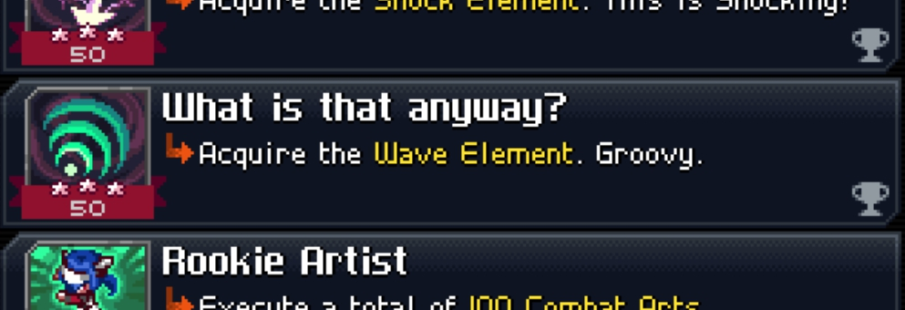

# Good-Vibes
`/results` contains wave.

# What is a wave?
> Wave is the fourth element and the element of choice of Hexacasts. It is associated with HP and Balls. It can also inflict the status condition Mark, which makes the victim vulnerable to ranged attacks. 

